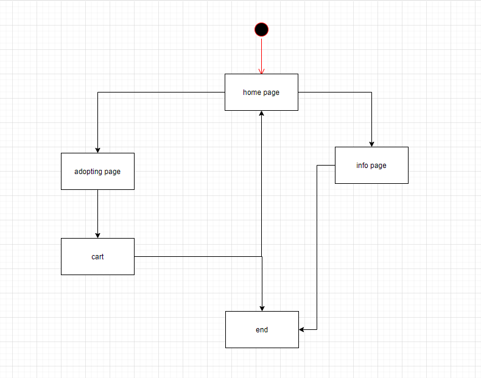

## requirements

## problem domaon 

the problem domain is the Hope company need a whole web page so the customer can adopt cats and dogs online and they need to let who want to adopt the cats or dogs accept the contract 

## risks 

so the first thing for risk in this project is the time ,they need the project as posible as i can like the need it in a week 
and the next risk is maybe the will have a changes and thats take time
Scope of work is poorly specified. 

## list of requirements

- cards to take you to each page
- add to cart (function)
- table to show what he/she would to adopt
- remove something from cart 
- save the pet  in local storage 
- add picture for pet for each breed and add information

## wire frame 

### home page

### Adopting page

## activity digram

## Coding and implementation technique
we will work on water fall 
water fall

## Testing technique

- Boundary Value Analysis (BVA)

- Error Guessing

BVA : Based on a test at the partition borders, boundary value analysis is a method for As well as a range of maximums and minimums for both within and outside of borders

error Guessing : As a software testing apprach, Mistake Guessing involve making educated guesses as to what kind of error may be As a result of this, the test analysts rely significantly on their past knowledge in order to anticipate what the difficult portion of the testing As a result, test analysts need to be knowledgeable and experienced in order to make superior mistake

# Tooling 

## What is visual studio code?
It is a free and open source code editor "MIT License" developed by Microsoft for many systems "Windows, Linux and macOS". This editor supports many languages and contains a large number of plugins that will make it easier for you to work on writing, editing and analyzing code. In 2018, the Visual Studio Code editor ranked first in the stackOverFlow survey as the most used development environment among developers.

Visual Studio supports many languages such as JavaScript, TypeScript, CSS, HTML and many other languages, and you can support more languages through the VS Code Marketplace. It also provides documentation for dealing with some languages that you can explore in the official documentation for the editor.

 ## Features

## VS Live Share

A wonderful addition developed by Microsoft that enables you to share the work environment with your colleagues with the power to modify the code or read only!
It can be installed from the Quick Open box by pressing Ctrl+P

## VS Live Share Whiteboard

This add-on builds on the previous add-on "VS Live Share" so that it provides you with a collaborative whiteboard in the same "session" in which you share the work environment with your colleagues.
It can be installed from the Quick Open box by pressing Ctrl+P

## Bracket Pair Colorizer

This add-on will show you the brackets by coloring each bracket in a distinct color, which shows you the scope of each function or class in the code.
It can be installed from the Quick Open box on the shortcut Ctrl + P 

## Pycharm

Picharm is an integrated development environment that is used for computer programming, especially programming in the Python language, as it was specifically designed for the Python language and all its branches such as (Django) and others.

It is very different from other software environments; Because it was developed specifically for python programmers, it was produced and developed by the Czech company JetBrains, a company known for developing many development environments; This indicates the strength of this environment for its users

There are two versions of this environment, the free version and the paid version, which is a professional version and comes with a set of features that were not present in the free version specifically for web developers

Downloading the PyCharm is very important for any Python programmer; Because it provides an ideal work environment that enables the programmer to complete his tasks in that easy and wonderful programming language, where the program comes with high and wonderful specifications that cover the programmer's need and also comes with all the necessary tools, as it calls all the files and libraries of the language and makes it easier for the programmer to search It gives him all the suggestions for the word he wants to type or search for, giving the icon to search for files, tools and all that is needed, and it supports all types of databases.

The program provides code analysis, graphical error detector, built-in unit testing tool, and integration with audit control systems. This environment has many great features that greatly improve productivity for programmers, and also allows change in program color and change in font type and size with complete freedom.

## Features

-	Intelligent Code Editor
-	Smart Code Navigation
-	Fast and Safe Refactorings

## Windows 
Definition of the Windows operating system The Windows operating system is a computer operating system developed by Microsoft with the aim of operating personal computers, and it is an operating system that includes the first GUI type user interface for computers, and is compatible with IBM. 90% of Windows versions are used.

For the first version of Windows The first version of Windows was released in 1985 AD, and at that time it was a GUI interface that is simply added to the disk operating system of "Microsoft" or "MS-DOS", and according to the licensed concepts used by "Apple Inc" in the Macintosh system. Its Windows operating system allowed DOS users to switch to a virtual desktop, and open graphical windows displaying the contents of folders and electronic files by clicking a single mouse button instead of typing commands at a text prompt.

The reason for naming Windows Microsoft calls most of its products with one word, which is why it often needs one word to describe the interface of the operating system used in the best way. Various tasks and programs at the same time, and in more detail the operating system was launched with the name “Microsoft Windows” due to the inability to put a trademark on a well-known name such as “Microsoft”

## Features
Support computers and devices with touch screens.
I personally like this feature very much.
One of the specifications of Windows 10 is that it fully supports computers with touch screens, just like the mobile phone. It also has many features and characteristics that allow users to do a lot via the touchpad on the laptop, where the process of zooming in and out on the screen (Zoom) can be done with fingers only, and the drop-down list or taskbar and others can also be shown using the fingers just like the phone and this is what I like a lot about this Fantastic feature

##Start Menu 
You can view it by clicking on the windows icon in the far left of the screen below. Unlike Windows 8, which does not have it, and most importantly, the Start menu has become more aesthetic and smooth in Windows 10. From this menu, you can shorten the way and access your files, photos and videos without getting tired, quickly and smoothly

## Task View
It is also one of the best features of Windows 10, which enables you to easily access the tasks that you have just done or in real time, and you can also move between them easily and smoothly, in addition to providing you with a complete archive of the tasks that you have performed through the computer for the last thirty days

## What is Linux 
Linux is - in the simplest terms - an operating system. Operating systems are computer programs that allow applications and users to access computer hardware to perform a desired operation. The operating system transmits a command from an application, for example, to a computer processor. Then the processor performs the required task, and then sends the results to the application via the operating system. Thus, the operating system plays the role of a link between the different parts of the computer.
From the previous definition, it appears to us that Linux is completely similar to any other operating system, such as: Windows and OS X. But in fact there is a difference that distinguishes the Linux operating system from the rest of the other operating systems. In 2008, the Linux operating system was a $25 billion system.

Because Linux is an open operating system, its development is done collaboratively, meaning that no single company is solely responsible for developing or supporting a Linux system. The companies that share the economic share of Linux share the costs of research and development with their partners and competitors. Thus, the distribution of the development burden for the Linux system between companies and individuals contributed positively to the creation of a large and effective development environment and a lot of unannounced software innovations.

More than 1,000 developers from more than 100 different companies participate in every new release of the Linux kernel. In the past two years alone, more than 3,200 developers from 200 companies have participated in the development of the Linux kernel, which is - that is, the kernel - which constitutes only a small part of the Linux system .

## Where is linux used?
One of the distinguishing features of Linux is "Where can we use Linux". Where we find that Windows and OS X are often used in personal computers such as desktop computers and laptops, while other operating systems, such as Symbian, are used in small devices such as mobile phones and PDAs, and supercomputers in laboratories Academics and major corporations use specialized operating systems such as AS/400 and Cray OS.

Linux on the other hand, started as a server operating system and then proved its quality as a desktop operating system, and today Linux can be used in a lot of devices ranging from watches to supercomputers

Features
-	Multiuser capability
-	Multitasking
-	Portability
-	Security

## What is GitHub
It is an open source "repository" hosting service, used mostly for computer code in a variety of different programming languages, and keeps track of the different changes made on each iteration. The service is able to do this by using, git: the revision control system that runs in the command interface.

Similar to other services including BitBucket, Microsoft Team Foundation Server, and more, but the number of users should matter to you if you want as many people as possible to see your project, as GitHub reports having over 31 million users, much more than its competitors. .
Other differences involve cost, as this service offers only private warehouses at an additional cost, while some other services offer free private warehouses. However, these usually come with limited storage and bandwidth.

Using GitHub makes it easy to collaborate with colleagues and peers and look back at previous versions of your work, if you haven't used it for your coding projects before.

## What are its uses?
It is used to store code for a project and keep track of all changes made to that code It allows developers to collaborate on a project more efficiently by providing tools to manage potential conflicting changes from multiple developers It allows developers to change, develop and improve programs from their public repositories Free, but private repositories are charged, each public or private repository contains all project files, as well as a history of each file's previous versions, and repositories can contain multiple collaborators.

All this talk about GitHub is perfect for programmers, and while it's not as popular you can actually use GitHub for any file types, and if you have a team that's constantly making changes to documents, you can use GitHub as your version control system. This practice is not common, as there are better alternatives in most cases, but it is something to keep in mind

## what is gitLab

Open DevOps platform GitLab is offered as a single app. Due to its uniqueness, GitLab offers software workflow optimization, freeing your organization from the limitations of a piecemeal toolchain. You'll see how GitLab delivers unrivaled insight and greater levels of productivity in a single application across the DevOps lifecycle.

## What GitLab does
GitLab is a single application that spans the entire software development lifecycle. If you're not using GitLab, your DevOps lifecycle is likely spread across any number of applications. These silos take overhead to integrate, manage, configure, and maintain, slowing down your team and your deployments. Moving to a single application will speed up your workflow and help you deliver better software, faster. Learn how GitLab can replace any number of your existing applications.

## what i will use for the porject 
for IDE im going with Visual Studio Code 
and for Operating System : windows
and for Version-control platform im going with gitHub