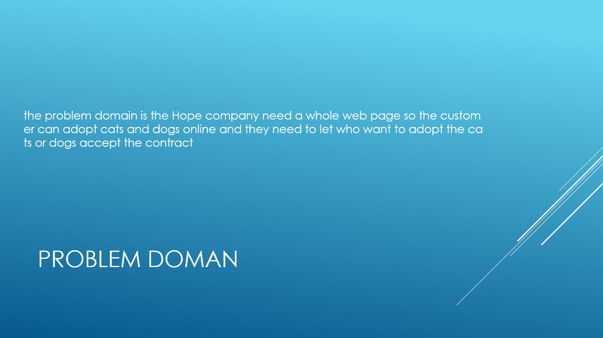

task 1 

## this is my power point presentation

and the feed back from the student they told me 

- I have to redisgin the home page 
- i have to do more functionality 
- I have to add more images and information for each breed

task 2 done

task 3 

for the feedback that I took from the students 

 I did new disign for my home page and i did more functionality and finally now i have more images and information foor each breed

 and the improvements i want to do 

 - and botton to add to cart
 - play more with css (disign)
 - if i have some extra time i like to add wish list and save it to local storge 
